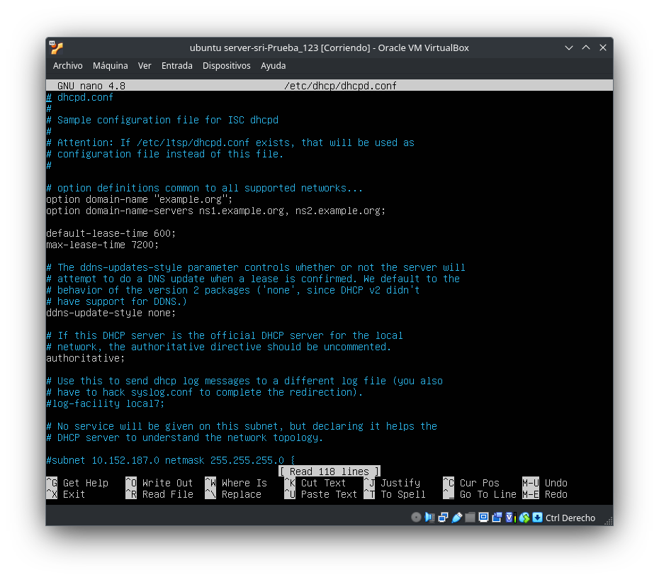
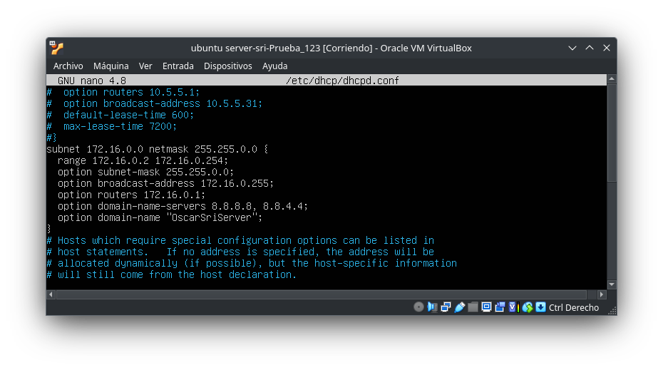
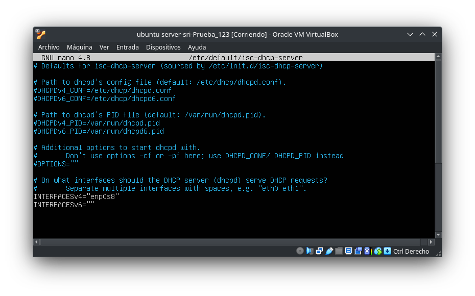
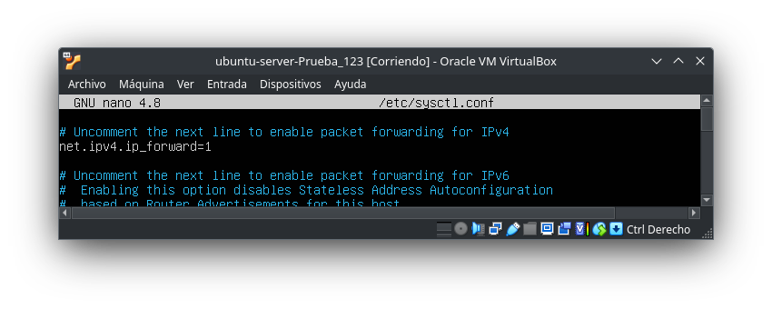
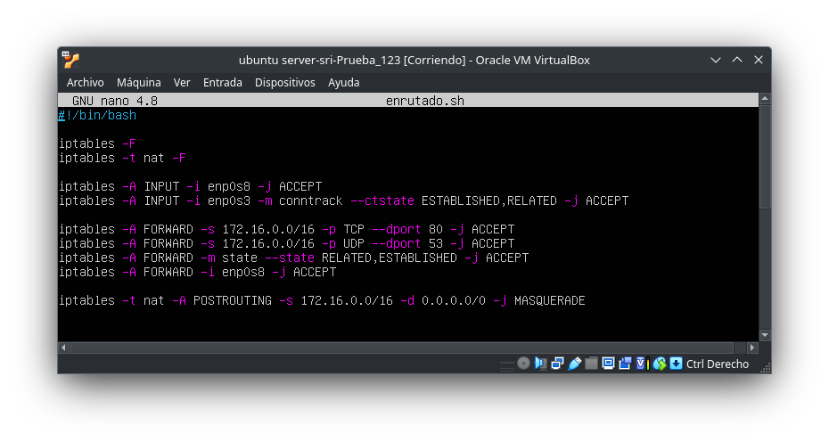
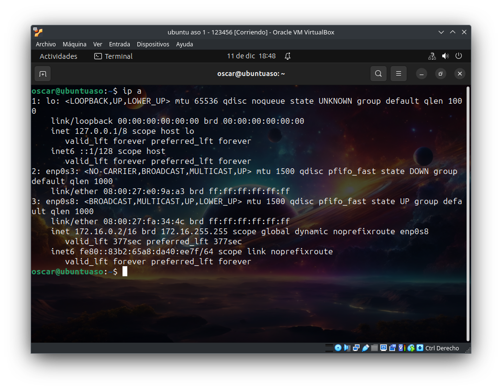

# Configuración de un Servidor DHCP


Para comenzar con la configuración de nuestro servidor **DHCP** en **Ubuntu Server**, debemos realizar la instalación de este, y una vez finalizada asignarle en VirtualBox dos adaptadores de red: uno como **adaptador puente** y el otro en **red interna** con el **modo promiscuo**, que permita la **conexión de máquinas virtuales**.

## Instalación del Paquete `isc-dhcp-server`

Una vez tengamos instalado y configurado nuestro ubuntu server comenzaremos por instalar el servidor DHCP con los siguientes comandos:

> sudo apt update

> sudo apt install isc-dhcp-server

Una vez instalado el servidor **DHCP**, **apagaremos** la interfaz que nos asigna la dirección **IP** proveniente del router externo, es decir, el **AP** de clase.

> [!IMPORTANT]
> Desconectarse de Internet al configurar un servidor DHCP es recomendable por razones de seguridad y estabilidad. Evita conflictos de direcciones IP, proporciona mayor seguridad al configurar el servidor, facilita pruebas y ajustes internos sin distracciones externas, ofrece más control y privacidad al reducir la exposición a amenazas externas, y evita actualizaciones automáticas que podrían interferir. En resumen, esta práctica proporciona un entorno controlado para la configuración, y una vez completada, se puede volver a conectar a Internet según sea necesario.

## Configuración del Fichero `00-installer-config.yaml`

Tras **desconectarnos de internet**, nos dirigiremos en nuestro Ubuntu Server al archivo **`00-installer-config.yaml`**, y lo modificaremos con Nano, ejecutando el siguiente comando:

> sudo nano /etc/netplan/00-installer-config.yaml


> [!NOTE]
> En esta sección, hemos llevado a cabo la configuración detallada de las interfaces de red. Este proceso incluyó la definición de las direcciones IP y la especificación de los servidores DNS correspondientes.

Una vez terminemos de configurar el archivo anterior, debemos lanzar el siguiente comando para que se apliquen los cambios.

> sudo netplan apply

## Configuración del Fichero `dhcpd.conf`

Tras aplicar los cambios procedemos a dirigirnos al archivo dhcpd.conf de la siguiente manera:

> sudo nano /etc/dhcp/dhcpd.conf

Lo modificaremos descomentando y agregando las lineas de texto que se muestran en las imágenes siguientes.



> [!IMPORTANT]
> Descomentaremos la linea **authoritative** como se muestra en la imágen anterior.



> [!IMPORTANT]
> En esta imagen se muestra donde debemos añadir la configuración de red que utilizará el servidor DHCP para asignar las IP

- Ejemplo del código:

```yml
subnet 172.168.0.0 netmask 255.255.0.0 {
  range 172.16.0.2 172.16.0.254;
  option subnet-mask 255.255.0.0;
  option broadcast-address 172.16.0.255;
  option routers 172.16.0.1;
  option domain-name-servers 8.8.8.8, 8.8.4.4;
  option domain-name "OscarSriServer";
}
```

La configuración del archivo **`dhcpd.conf`** establece un servidor DHCP para la subred **`172.16.0.0/16`**. Define un rango de direcciones IP de **`172.16.0.2`** a **`172.16.0.254`** y proporciona información a los clientes, como la máscara de subred, la dirección de broadcast, la puerta de enlace, los servidores **DNS** (usando los de Google), y el nombre del dominio ("OscarSriServer").

## Configuración del Fichero `isc-dhcp-server`

Al completar el paso anterior nos dirigiremos al archivo **isc-dhcp-server** y asignamos, de la siguiente manera, la interfaz en la que el servidor DHCP deberá realizar las solicitudes:

> sudo nano /etc/default/isc-dhcp-server



## Configuración del Fichero `sysctl.conf`

Una vez concluyamos el paso anterior nos dirigiremos al fichero sysctl.conf

> sudo nano /etc/sysctl.conf

Descomentamos la siguiente linea que se muestra en la imagen.



Tras descomentar la linea lanzaremos el siguiente comando en la terminal para activar el reenvío de IP:

> sudo sysctl -w net.ipv4.ip_forward = 1

## Configuración del Firewall `iptables`

Después de completar la tarea anterior, procederemos a configurar el filtrado de paquetes utilizando iptables en un script llamado enrutado.sh, que contendrá lo siguiente:



## Comprobación
Una vez hayamos terminado de configurar el router en nuestro Ubuntu Server, procederemos a comprobar que este funciona correctamente con un cliente.



En esta imagen podemos comprobar que nuestro servidor DHCP asigna de manera correcta las direcciones IP.