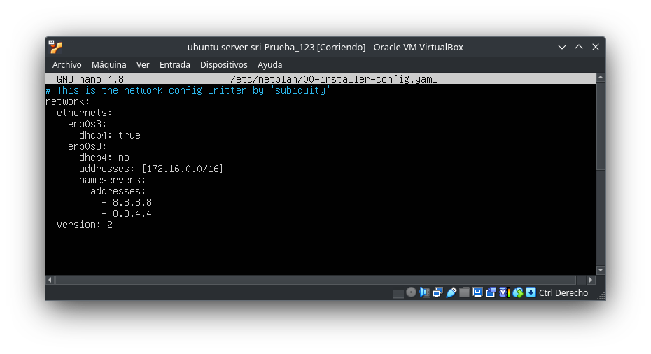

# Configuración de un Servidor DHCP

Para comenzar con la configuración de nuestro servidor **DHCP** en **Ubuntu Server**, debemos realizar la instalación de este, y una vez finalizada asignarle en VirtualBox dos adaptadores de red: uno como **adaptador puente** y el otro en **red interna** con el **modo promiscuo**, que permita la **conexión de máquinas virtuales**.

## Instalación del Paquete `isc-dhcp-server`

Una vez tengamos instalado y configurado nuestro ubuntu server comenzaremos por instalar el servidor DHCP con los siguientes comandos:

> sudo apt update

> sudo apt install isc-dhcp-server

Una vez instalado el servidor **DHCP**, **apagaremos** la interfaz que nos asigna la dirección **IP** proveniente del router externo, es decir, el **AP** de clase.

> [!IMPORTANT]
> Desconectarse de Internet al configurar un servidor DHCP es recomendable por razones de seguridad y estabilidad. Evita conflictos de direcciones IP, proporciona mayor seguridad al configurar el servidor, facilita pruebas y ajustes internos sin distracciones externas, ofrece más control y privacidad al reducir la exposición a amenazas externas, y evita actualizaciones automáticas que podrían interferir. En resumen, esta práctica proporciona un entorno controlado para la configuración, y una vez completada, se puede volver a conectar a Internet según sea necesario.

## Configuración del Fichero `00-installer-config.yaml`

Tras **desconectarnos de internet**, nos dirigiremos en nuestro Ubuntu Server al archivo **`00-installer-config.yaml`**, y lo modificaremos con Nano, ejecutando el siguiente comando:

> sudo nano /etc/netplan/00-installer-config.yaml

> [!NOTE]
> En esta sección, hemos llevado a cabo la configuración detallada de las interfaces de red. Este proceso incluyó la definición de las direcciones IP y la especificación de los servidores DNS correspondientes.

